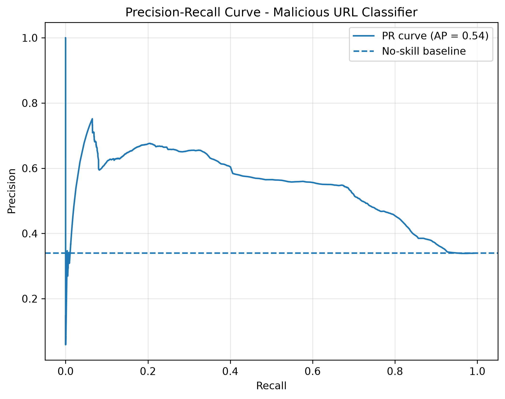

# Malicious URL Detector

A machine-learning classifier that flags **malicious URLs** (phishing, malware, defacement) from benign ones using only features extractable from the URL string and its host — **no live network calls at inference time**.


---

## Overview

This project trains a supervised binary classifier to detect malicious URLs before a user clicks — the kind of model that sits inside an email gateway, proxy, or browser extension. It's built from the ground up: raw URLs in, engineered features out, honest evaluation throughout.

The emphasis is on **methodology, not just a score**. The hard part of security ML isn't calling `.fit()` — it's avoiding the subtle mistakes (data leakage, source artifacts, metric misuse) that make a model look great in a notebook and fail in production. Those are treated as first-class concerns here.

**Headline result:** a genuinely useful model built from just four hand-engineered features — test-set F1 of 0.60 on the malicious class, closely matching the cross-validated estimate of 0.62, which confirms the evaluation is honest and leakage-free.

## What This Project Demonstrates

- **Feature engineering** from semi-structured text — lexical, host-based, and structural signals derived from exploratory analysis, not copied from a tutorial. Rejected features are documented alongside the kept ones.
- **Leakage-safe methodology** — a single early train/test split *grouped by registered domain*, cross-validation for model selection, and a test set touched exactly once.
- **Metric literacy** — precision / recall / F1 / PR-AUC chosen deliberately for an imbalanced, asymmetric-cost problem, rather than headline accuracy.
- **Model comparison** across three families with documented tuning.
- **Error analysis** — characterizing *what* the model gets wrong and *why*, broken down by attack type.

## Tech Stack

- **Language:** Python 3.14
- **ML:** scikit-learn
- **Data:** pandas, NumPy, tldextract (host parsing)
- **Viz:** matplotlib

## Dataset

Trained on a labeled corpus of ~640k URLs (benign / phishing / malware / defacement) sourced from Kaggle. Raw data is git-ignored.

Class balance, label provenance, and known source biases are documented in the EDA notebook — because *where the labels came from* shapes what the model actually learns. Two findings from the data audit:

- **Conflicting labels revealed the data's origin.** Six URLs carried both benign and malicious labels; on inspection all were legitimate sites (Wikipedia, Library of Congress, etc.) erroneously duplicated into the phishing feed — evidence the dataset was assembled by concatenating separate benign and malicious sources. They were dropped.
- **Source-artifact awareness.** Because benign and malicious URLs came from different feeds, some apparent "signal" risks being a collection artifact rather than a property of maliciousness. This shaped which features were trusted (see below).

## Features

Four features survived exploratory analysis, engineered in `features.py` and applied identically to train and test:

| Feature | Type | Signal |
|---|---|---|
| `url_length` | numeric | Weak but real — malicious URLs run slightly longer, mostly in the upper tail. |
| `has_at` | boolean | Rare but discriminative — `@` is ~2.4x enriched in malicious URLs. |
| `has_ip` | boolean | Strongest — a raw IP host is ~117x more common in malicious URLs. |
| `subdomain_count` | numeric | Clean separation — benign median 0 subdomains vs malicious median 1. |

**Rejected features (documented for transparency):**

- `digit_count` / `digit_ratio` — no class separation; excluded.
- `has_https` — excluded as a **collection artifact**: the URL scheme was stripped from ~72% of rows, so this measured how the data was cleaned, not whether a site was safe.

## Project Structure

```
malicious-url-classifier/
├── README.md
├── requirements.txt
├── .gitignore
├── features.py            # feature extraction module (shared by all notebooks)
├── notebooks/
│   ├── 01_eda.ipynb       # exploration, cleaning, feature analysis
│   ├── 02_baseline.ipynb  # leakage-free split + baseline model
│   ├── 03_models.ipynb    # model comparison + tuning
│   └── 04_eval.ipynb      # final evaluation + error analysis
├── images/                # committed plots
└── data/                  # git-ignored; dataset fetched separately
```

## Getting Started

```bash
git clone https://github.com/DevAnnafi/malicious-url-classifier.git
cd malicious-url-classifier

python -m venv .venv && source .venv/bin/activate
pip install -r requirements.txt

# Fetch the dataset into data/, then run the notebooks in order.
```

## Methodology

The core discipline of the project — each row is a deliberate defense against a way ML projects lie to their authors:

| Concern | How it's handled |
|---|---|
| **Domain-memorization leakage** | Split is grouped by registered domain (via `GroupShuffleSplit` + `tldextract`), so no domain appears in both train and test. Verified: **zero domain overlap**, with the ~33% malicious ratio preserved on both sides. |
| **Class imbalance (67/33)** | Handled with `class_weight="balanced"`; reported with PR-AUC and per-class precision/recall rather than accuracy. |
| **Model selection leakage** | Models compared via 5-fold cross-validation on the training set only, scored on F1. The test set was evaluated exactly once, at the very end. |
| **Accuracy as a trap** | The baseline scores 67% accuracy while catching only 8% of threats — documented explicitly to justify why F1/recall, not accuracy, drive every decision. |

## Results

Three model families were compared by cross-validated F1 on the malicious class (training set only):

| Model | CV F1 (malicious) | Notes |
|---|---|---|
| Logistic Regression (baseline) | 0.15 | Erratic; exploits imbalance by predicting the majority class |
| **Logistic Regression (balanced)** | **0.62** | **Winner** — highest and most stable across folds |
| Random Forest (balanced) | 0.58 | Wobbly across folds |
| Gradient Boosting (balanced) | 0.61 | Stable but did not beat balanced LR |

A grid search over the regularization strength `C` selected `C=0.01` but did not improve on the default — the model was already near-optimal, consistent with a small, additive feature set.

**Notable finding:** the *simplest* model won. Two tree-based models, which should exploit feature interactions, failed to beat a linear model — indicating the feature set's signal is largely additive rather than interaction-driven.

### Final model — held-out test set (evaluated once)

| Metric (malicious class) | Value |
|---|---|
| Precision | 0.54 |
| Recall | 0.68 |
| F1 | 0.60 |
| PR-AUC (average precision) | 0.54 |

Test F1 (0.60) closely matches CV F1 (0.62) — **direct evidence the methodology is leakage-free and did not overfit model selection.** PR-AUC of 0.54 sits well above the ~0.33 no-skill baseline (the malicious prevalence), confirming real signal.



**Operating threshold.** At the default 0.5 threshold the model prioritizes catching threats (68% recall) over precision (54%) — an appropriate trade for a security filter, where a missed threat costs more than a false alarm. The PR curve shows recall can be pushed higher by lowering the threshold, at the cost of more false positives; the right operating point is a deployment policy decision.

### Error Analysis

Per-type recall on missed threats reveals a clear weak spot:

| Attack type | Recall | Share of malicious URLs |
|---|---|---|
| Defacement | 69% | ~45% |
| Phishing | 68% | ~44% |
| **Malware** | **58%** | **~11%** |

The model catches defacement and phishing comparably (~68%), but **malware recall drops to 58%** — a ~10-point gap. Malware is the least-represented attack class (~11% of malicious URLs), so the model had the least signal to learn it. Raw miss *counts* obscure this (malware has the fewest misses in absolute terms); controlling for prevalence via per-type recall exposes it.

## Limitations & Next Steps

- **Malware under-detection** — driven by class under-representation; collecting more malware samples or engineering malware-specific features is the clearest improvement.
- **Scheme-stripped data** — the dataset's missing URL schemes ruled out an entire category of features; a cleaner corpus would allow scheme-based signals.
- **Duplicated setup across notebooks** — the load/feature/split pipeline is copied across three notebooks; a shared data-prep module would be the next refactor.

### Roadmap

- [ ] Refactor shared setup into a data-prep module
- [ ] Model calibration + reliability curve
- [ ] FastAPI `/predict` endpoint
- [ ] Adversarial robustness: hand-crafted evasion URLs
- [ ] Feature-importance study (SHAP / permutation importance)

## Author

**Annafi Islam** — Cybersecurity Engineer
[GitHub](https://github.com/DevAnnafi) · [LinkedIn](https://linkedin.com/in/annafi-islam) · [Portfolio](https://annafiislam.com)

## License

Released under the MIT License. See `LICENSE` for details.